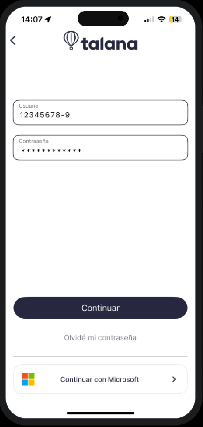
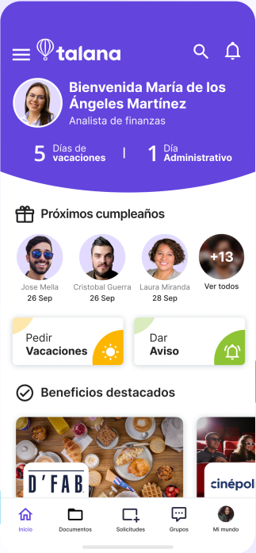
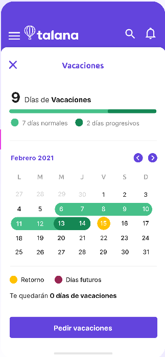
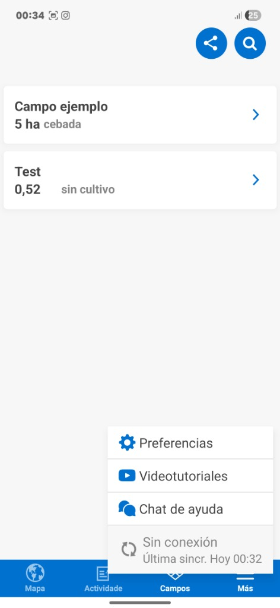
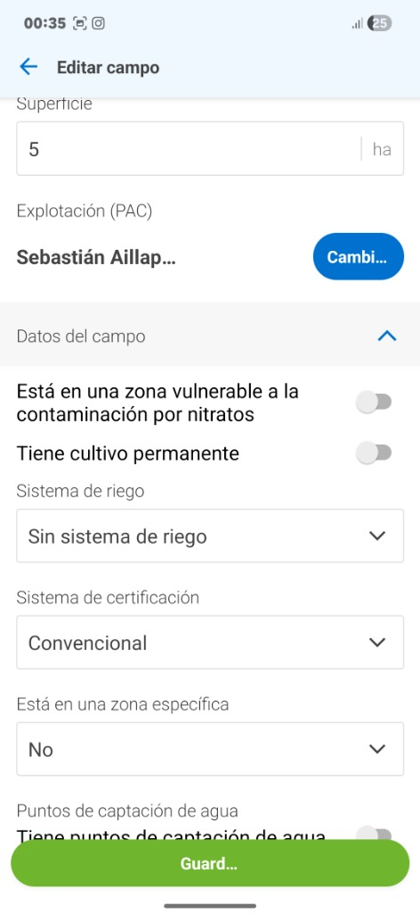
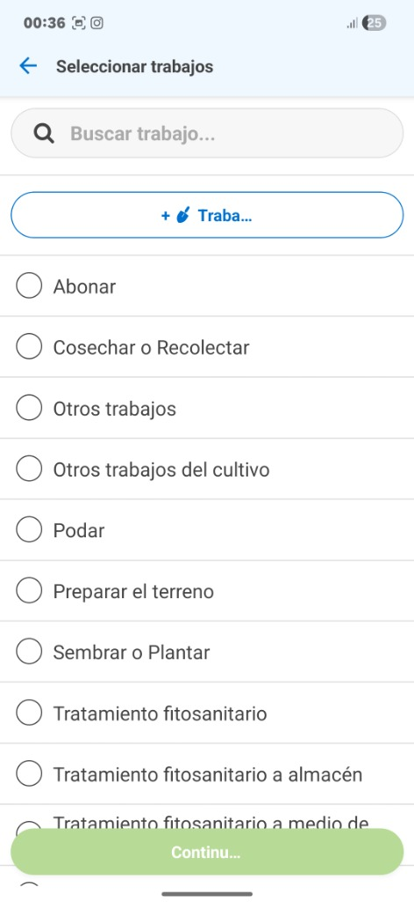
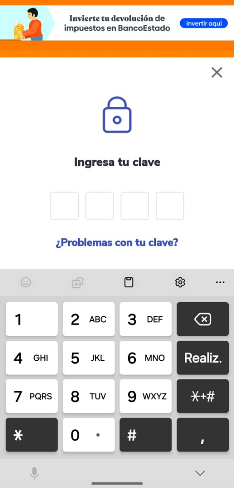
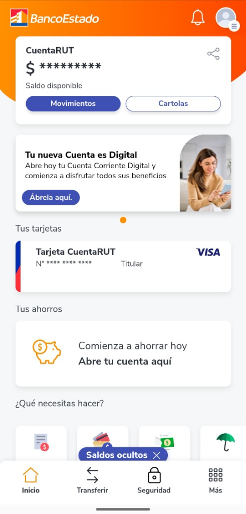
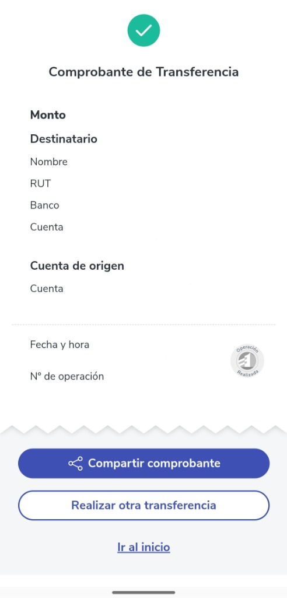

# Plusit Competitive Benchmark Analysis
> **UX Element Plane: Strategy & Scope** 

This document contains the complete and structured competitive benchmark analysis for the **Plusit** project, aligned with the Strategy and Scope planes of the UX Elements model.

---

## 1. Synthetic Comparative Table

| Dimension / Tool | Talana (Direct Competitor) | Agroptima (Analogue Competitor) | BancoEstado (Design Reference) | **Plusit (Group Proposal)** |
|---|---|---|---|---|
| **Target User Profile** | Corporate office employees, managers, and desk-based staff. | Farm owners, agronomists, and tractor operators. | General Chilean population (highly inclusive, RUT-based). | **Seasonal agricultural harvesters** in La Araucanía. |
| **Value Proposition** | All-in-one HR platform for payroll, signatures, and team communications. | Digital farm notebook to track activities, crop costs, and compliance. | Secure, ultra-accessible mobile banking for RUT holders. | **Simplified, offline-first HR** and yield tracking for temporary workers. |
| **Onboarding Flow** | Requires corporate email/credentials and multi-step password creation. | Multi-step company setup, field plotting, and crop definitions. | Quick login using RUT and a secure 4-digit PIN. | **No signup required.** Secure cached login via RUT and simple SMS/PIN. |
| **Navigation Patterns** | Bottom navigation bar with deep, nested text-heavy tab menus. | Bottom tab bar (`Map`, `Activity`, `Fields`, `More`) with side drawers. | Minimalist tab bar and large dashboard buttons. | **Dashboard-centric (Hub-and-Spoke)** with a global "+" shortcut in the navbar. |
| **Visual Design** | Modern corporate branding, thin fonts, low density elements. | Field-themed green branding, dense lists, detailed data grids. | High-contrast orange/blue, bold text, spacious icons. | **Oversized elements**, high-contrast primary colors (contrast > 4.5:1). |
| **Observable Accessibility** | Text-based, small buttons, thin fonts, requires pinch-to-zoom for PDFs. | Dense spreadsheets, small checkboxes, standard system keyboards. | Extra-large touch targets (>48dp), high contrast, screen reader friendly. | **Fat-finger optimized** (>56dp tap zones), custom numeric keypad, voice notes. |
| **Connectivity Resilience** | **None.** Fails completely and refuses to load screens without internet. | **High.** Full offline task caching and background database sync. | **None.** Requires secure active SSL connection to operate. | **Full Offline-First.** Local SQLite caching for attendance, yield logs, and requests. |
| **Cognitive Load** | **High.** Legal payroll terminology and complex contract panels. | **High.** Requires entering agronomic data, dosage, and PAC details. | **Very Low.** Clean, familiar actions ("Transfer", "PagoRut"). | **Extremely Low.** Visual icons, traffic-light status, and audio notes. |
| **Yield & Salary calculator** | **None.** Static PDF payroll slips displayed after monthly HR process. | **Activity-only.** Tracks task hours and tractor usage, no salary simulation. | **None.** Standard balance inquiry and transfer reports. | **Real-Time Simulator.** Dynamic calculation of daily yield crates and estimated pay. |

---

## 2. Individual Tool Evaluation

### A. Talana (Direct Competitor)

Talana represents the standard corporate HR software in Chile. While feature-complete for payroll, it fails to address the physical and environmental constraints of agricultural field workers.

*   **Screenshot 1: Login Screen**

    
    *   *Positive Aspect:* Clear placeholder for RUT formatting.
    *   *Area for Improvement (Heuristic #5: Error Prevention):* Small input fields and relies on standard alphanumeric keyboard, which increases typos for manual labor hands. Requires memorizing passwords instead of simple PINs.

*   **Screenshot 2: Main Dashboard**

    
    *   *Positive Aspect:* Prominent cards for "Pedir Vacaciones" and "Dar Aviso".
    *   *Area for Improvement (Heuristic #2: Match between System and Real World):* Densely packed information (e.g., birthdays list, financial banner) that creates visual noise. The icons and text links are small and low-contrast.

*   **Screenshot 3: Vacation Request**

    
    *   *Positive Aspect:* Simple progress bar showing remaining vacation days.
    *   *Area for Improvement (Heuristic #8: Aesthetic and Minimalist Design):* The calendar grid cells are very small, making touch target accuracy difficult under sunlight or with tired hands.

---

### B. Agroptima (Analogue Competitor)

Agroptima is a leading field-management app. It excels at offline data entry, but its complex scope is geared towards managers, not seasonal pickers.

*   **Screenshot 1: Fields & Connection Status**

    
    *   *Positive Aspect (Heuristic #1: Visibility of System Status):* Displays a clear "Sin conexión" (Offline) status bar at the bottom with the last sync timestamp, giving the user peace of mind.
    *   *Area for Improvement:* The main list displays hectares and crop types in small, grey fonts that are hard to read outdoors.

*   **Screenshot 2: Field Details**

    
    *   *Positive Aspect:* Toggle switches for quick yes/no options.
    *   *Area for Improvement (Cognitive Load):* High density of agricultural jargon ("zona vulnerable a contaminación por nitratos", "PAC", "sistema de riego"). Out-of-scope and overwhelming for temporary harvesters.

*   **Screenshot 3: Task Selection**

    
    *   *Positive Aspect:* Includes a search bar to filter long lists.
    *   *Area for Improvement (Heuristic #8: Aesthetic and Minimalist Design):* A long, scrolling text list with tiny radio buttons. It lacks visual icons representing tasks (e.g., a tractor icon for tilling, a basket for harvesting).

---

### C. BancoEstado App (Design Reference)

The BancoEstado mobile application is the gold standard for digital accessibility in Chile, designed to be used by people of all ages and education levels.

*   **Screenshot 1: PIN Login**

    
    *   *Positive Aspect (Heuristic #5: Error Prevention):* Extremely simple numeric code entry (4-digit PIN) utilizing a customized, large-button keypad. Avoids the complexity of alphanumeric passwords.
    *   *Area for Improvement:* The top promotional banner adds unnecessary visual distraction during a secure entry flow.

*   **Screenshot 2: Main Account Dashboard**

    
    *   *Positive Aspect (Heuristic #8: Aesthetic and Minimalist Design):* Clean hierarchy with huge touch targets. Balance masking option (`CuentaRUT $ **********`) protects privacy in public spaces.
    *   *Area for Improvement:* The bottom menu icons are relatively small compared to the massive main buttons, which may confuse older users.

*   **Screenshot 3: Transfer Receipt**

    
    *   *Positive Aspect (Heuristic #1: Visibility of System Status):* Green checkmark at the top indicates success immediately. The prominent "Compartir comprobante" (Share receipt) button maps to the user's need to verify transactions with family.
    *   *Area for Improvement:* The text fields containing transfer details are aligned to the left, which might be hard to read on very wide phone screens.
