# Plusit 
Streamlined labor management app for seasonal workers.

## Team
- **Sebastian Aillapan (Project Manager and Analyst)** 
- **John Fernandez (Designer and Analyst)**
    
## Figma Links
* [Plusit Interactive Design & Prototypes](https://www.figma.com/design/9IAGdbV9y2dXPuQIlkDHqM/Plusit?node-id=0-1&t=w2iEPmNojqyeBq7a-1)

## UX Design & Research Methodology (Garrett's Five Planes)
To ensure a rigorous, user-centered development process, our research and design deliverables are structured according to **Jesse James Garrett's Five Planes of UX**:

| UX Element Plane | Deliverables in this Repository |
| :--- | :--- |
| **1. Strategy** | [2. Key Features](#2-key-features-value-proposition) [3. Strategy (Value Proposition Canvas)](#3-strategy) |
| **2. Scope** | [4. Solutions Scope (In/Out of Scope, Personas)](#4-solutions-scope) [5. Benchmark (Competitive Analysis)](#5-benchmark) |
| **3. Structure** | [6. Navigation Flow](#6-navigation-flow) [7. Customer Journey Map](#7-customer-journey-map) |
| **4. Skeleton** | [8. Wireframes (Low-Fi Blueprints)](#8-wireframes) |
| **5. Surface** | [9. HD Screens (Usability Solutions)](#9-hd-screens) |

---

## 1. About the Project
Plusit is a mobile application designed specifically for seasonal workers (formal temporary workers) in the agricultural, forestry, and packing sectors in the La Araucanía region, Chile.
The project was created to solve a critical User Experience (UX) gap: the disconnect between Human Resources departments and field workers who face conditions of low digital literacy, limited hardware (low-end phones), and intermittent or no connectivity.

## 2. Key Features (Value Proposition)
> **UX Element Plane: Strategy** 

* **Offline Mode:** Ensures the app remains functional in rural areas with intermittent or no signal.
* **Fatt-Finger Friendly Design:** Large buttons and extended touch zones prevent errors for users with tired hands or damaged screens
* **Performance Simulator:** A visual tool to track daily yield per crate and estimate earnings in real-time.
* **Shift Swapping Dashboard:** A simplified system for workers to coordinate turn changes for personal or family needs
* **Visual Confirmation:** Clear status indicators like the "Permit Status Traffic Light" and "One-tap share with family" to simplify communication with loved ones and supervisors.

## 3. Strategy
> **UX Element Plane: Strategy** 

The first step under the Elements of User Experience is the Strategy plane, which focuses on incorporating not only what the people running the application want to get out of it but what the users want to get out of the application.

From this approach, a Value Proposition Canvas is used to determine what the people want to earn from our solution and how we are going to respond to those needs.

## 4. Solutions Scope
> **UX Element Plane: Scope** 

The Solutions Scope defines the functional boundaries of Plusit. As defined in the "Five Planes" model of UX, this scope acts as the bridge between our Strategy (the "why") and the Structure/Skeleton (the "how"). The objective of this scope is to prevent "feature creep" (uncontrolled accumulation of features) and maintain a laser focus on the critical needs of our seasonal workers.

In-Scope (What we are building):

* **Attendance & Scheduling:** Offline-first attendance tracking and shift management.
* **Transparency:** Simplified salary visualization and daily yield (kilos/crates) counters.
* **Communication:** A simplified permit request system using voice notes and status "traffic light" indicators.
* **Extreme Accessibility:** Interfaces designed with "Fat-Finger Friendly" principles and cognitive load reduction.

Out-of-Scope (Constraints):

* **Complex Recruitment:** No CV uploading or job application modules, as our target user is already hired.
* **Heavy Media:** Video tutorials are excluded due to our users' mobile data constraints.
* **Full HR Accounting:** The app does not replace HR accounting software; it acts solely as a simplified UI to visualize data already processed by the company.

### UX Personas

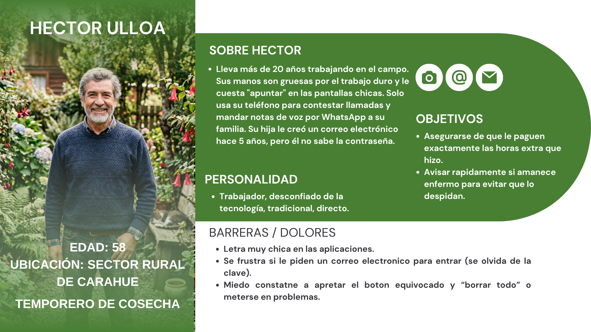
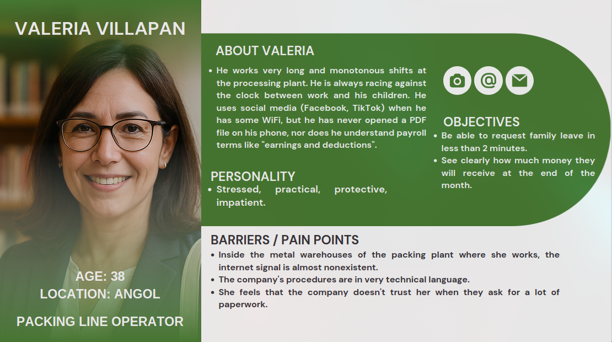
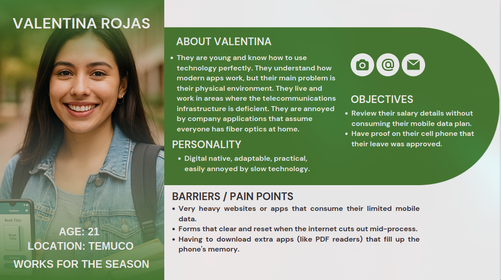
## 5. Benchmark
> **UX Element Plane: Strategy & Scope** 

In order to develop an application that meets the expectations and needs of users, it is essential to carry out an exhaustive analysis of existing applications on the market, especially those that are direct competitors. This process, known as benchmarking, allows us to identify both the shortcomings and the positive aspects of these applications, in order to integrate them optimally into our own product.

By studying competing applications, we can learn from their mistakes and avoid repeating them in our application. In addition, we can identify successful features and functionalities that we can adopt and implement in our solution, thus providing a superior experience to our users.
Products Evaluated: 

* **Direct Competitors:** Buk / Talana (Chilean HR apps focused on office environments).

* **Analog Competitor:** Agroptima (Field-based agricultural task management).

* **Design Reference:** BancoEstado (Chilean standard for accessibility and RUT-based login).

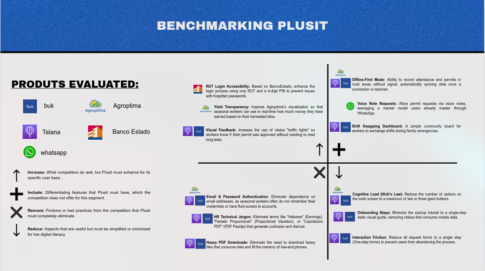

👉 **[Read the full Competitive Benchmark Analysis here](BENCHMARK.md)**

## 6. Navigation Flow
> **UX Element Plane: Structure** 

The navigation architecture of Plusit is designed with a **Dashboard-centric (Hub-and-Spoke)** pattern. This structure is specifically chosen to reduce cognitive load for seasonal workers with low digital literacy, as it provides a central, familiar starting point (the Home screen) for all primary tasks and prevents users from getting lost in deep, nested menus.
Key features of this navigation flow include:
* **Centralized Hub:** Every operational module (Salary Simulator, Shift Swap, Benefits, Performance, and Payments) is directly accessible from the main dashboard with a single tap.
* **Global Navigation Shortcut:** A global "+" button is integrated into the bottom navigation bar, providing instant, single-tap redirection to the Requests/Permits module from any screen.
* **Linear Task Flows:** Sub-processes, such as shift publishing or viewing detailed monthly payouts, follow a strict linear flow with clear back navigation to maintain context.
Below is the conceptual navigation flow of the Plusit application:

## 7. Customer Journey Map
> **UX Element Plane: Structure** 

The Customer Journey Map outlines the daily work cycle of **Héctor**, a 52-year-old seasonal harvester with over 20 years of experience in manual labor. Due to physical fatigue, calloused hands, and limited digital literacy, Héctor struggles with standard complex mobile interfaces. 
This map visualizes his journey across five key touchpoints in the Plusit application:
1. **Shift Swapping:** Coordinating schedule changes with peers to balance labor and family events.
2. **Harvesting & Yield Input:** Logging daily crates in real-time and calculating earnings using the simplified, oversized numeric keypad.
3. **Requesting Leave:** Submitting emergency permissions via voice note directly from the field, triggered easily using the navbar shortcut (+).
4. **Redeeming Benefits:** Accessing and claiming company incentives and performance-based rewards.
5. **Payout Day:** Reviewing monthly salary breakdowns, bonuses, and deductions in a simplified and transparent visual dashboard.
The journey demonstrates how Plusit's offline-first database, "fat-finger-friendly" touch zones, voice inputs, and visual status indicators directly mitigate the worker's field-based pain points.

## 8. Wireframes
> **UX Element Plane: Skeleton** 

This section presents the blueprint layout of the platform's core interfaces. The following wireframes illustrate the user journey from initial authentication to essential administrative actions, ensuring a clean, accessible, and user-centered operational flow.

**Wireframe - Login, Sign Up & Home Process:** Conceptualizes the user authentication lifecycle and onboarding path toward the main dashboard.

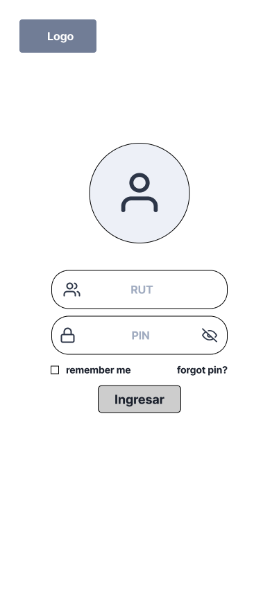

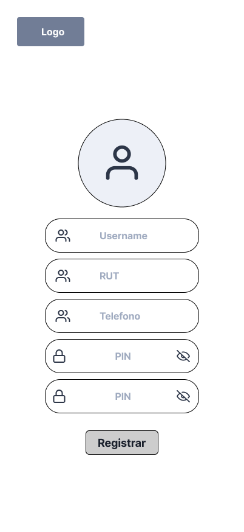
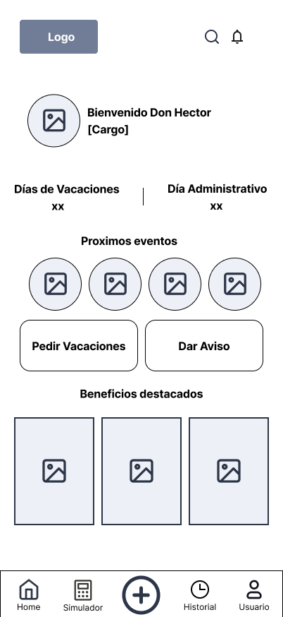

**Wireframe - Time Off Request Process:** Outlines the simplified flow for submitting quick administrative permissions and short-term sick leaves.

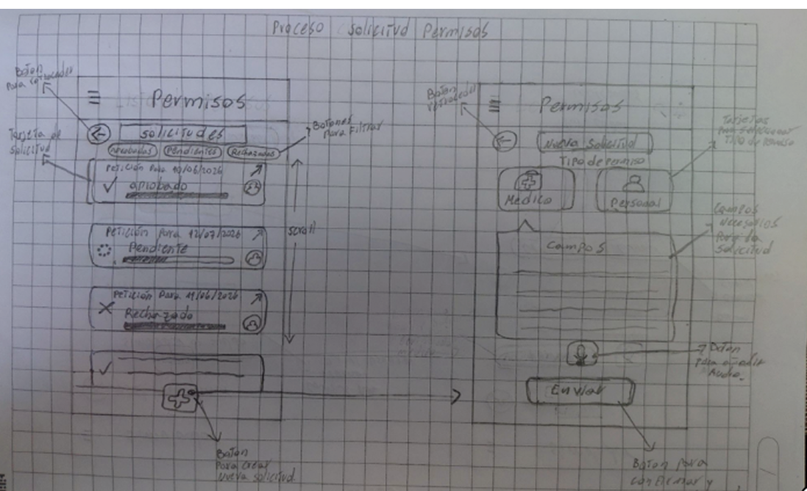
.png)
.png)

**Wireframe - Vacation Request Process:** Displays the interactive calendar-driven steps to plan and request extended annual leave.

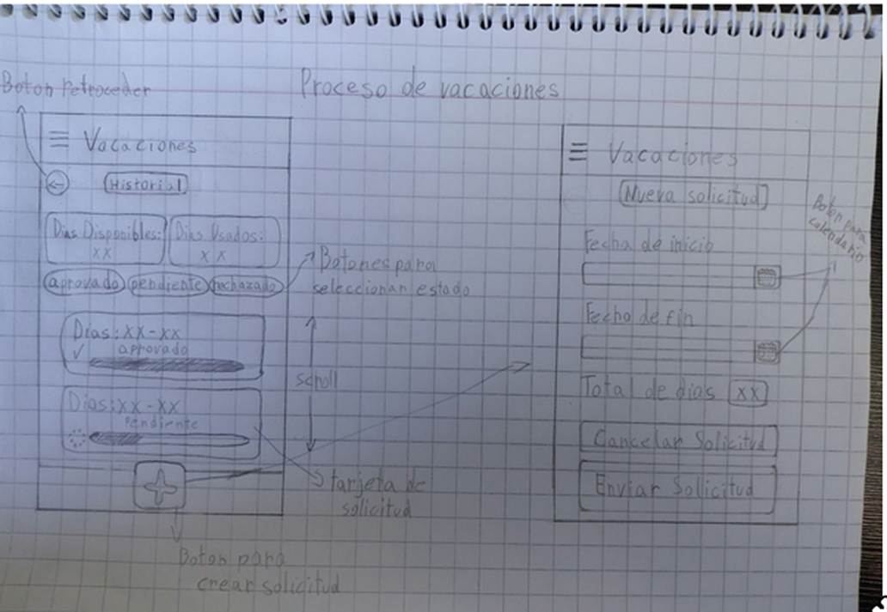
.png)
.png)

**Wireframe - Salary Simulator Process:** Visualizes the dynamic calculation tool designed to estimate payroll metrics, bonuses, and net pay deductions.

## 9. HD Screens
> **UX Element Plane: Surface** 

### 1. Authentication & Onboarding Flow

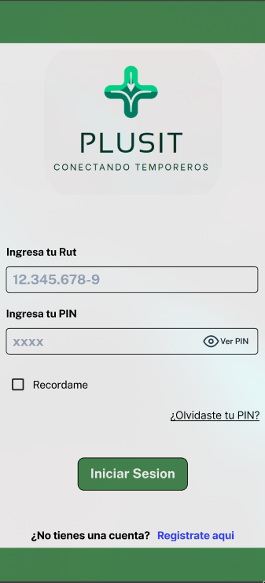
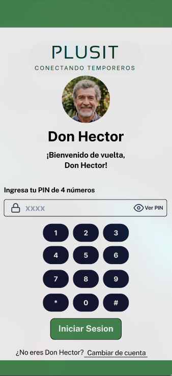
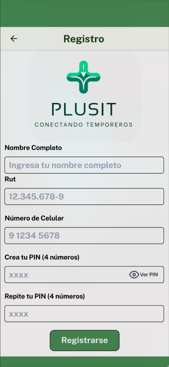

**The UX Challenge:** Seasonal agricultural workers often struggle with complex alphanumeric passwords, lengthy signup forms, and small native device keyboards. This leads to input errors and high drop-off rates during setup, especially on low-end devices with damaged screens.

**Our Solution:**
* **RUT & PIN Authentication (Screen 1):** We replaced the traditional email requirement with the Chilean National ID (RUT) and a simple 4-digit PIN. This aligns with familiar mental models (like local bank apps) and reduces the cognitive load.
* **Cached Quick-Login & Custom Keypad (Screen 2):** When "Recordarme" (Remember me) is active, the app displays the user's name (using the mockup's example: "Don Héctor") and avatar. We integrated a custom, extra-large numeric keypad to completely bypass the native system keyboard, ensuring error-free input for tired hands.
* **Simplified Registration (Screen 3):** The sign-up form requires only essential data (RUT, Name, Phone, and PIN setup) with large text boxes, clear focus rings, and numerical formatting.

---

### 2. Main Dashboard & Configuration Flow

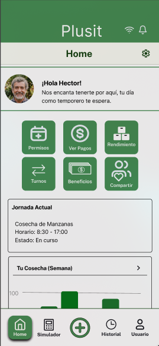
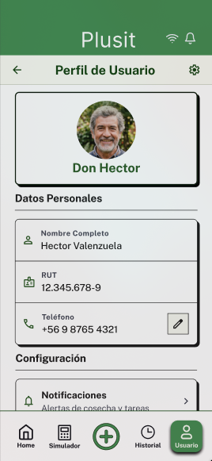
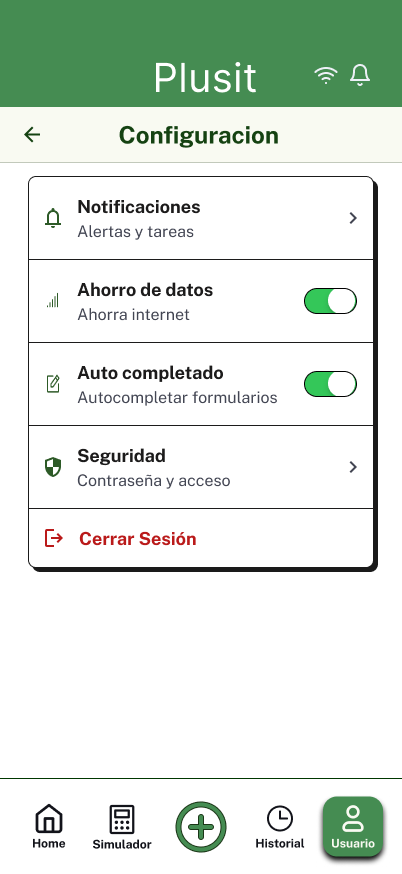

**The UX Challenge:** Densely packed menus and small text links cause frustration and confusion for workers. Accessing profile info or key settings should not require deep navigation path searches.

**Our Solution:**
* **Dashboard Home (Screen 1):** Organized around a clean, Hub-and-Spoke grid layout. Key operations (Simulation, Shift Swap, Benefits) are represented by large, high-contrast card buttons. A global "+" shortcut in the navbar provides instant access to requests.
* **Simple Profile Card (Screen 2):** Displays essential contract info, supervisor name, and company telephone in a simple, scroll-free layout with extra-large text sizes.
* **System Accessibility Toggles (Screen 3):** Simple toggle switches for high contrast mode and text size scaling to customize readability under changing sunlight conditions.

---

### 3. Salary Simulation & Performance Flow

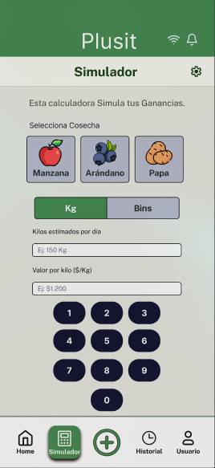
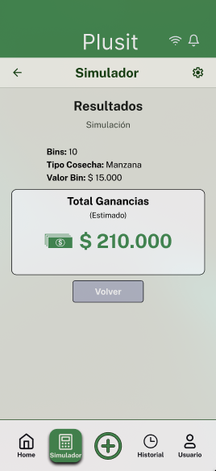
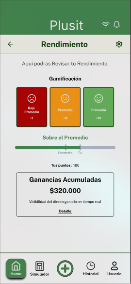
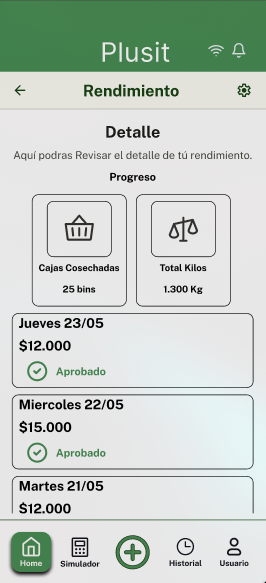

**The UX Challenge:** Manual yield tracking (kilos/crates) under direct sunlight is difficult. Logging numbers on a standard keyboard with calloused, dirty, or wet fingers leads to constant typos and payment disputes.

**Our Solution:**
* **Simulator Input (Screen 1):** Features simple crop cards (Apple, Blueberry, Potato) with friendly graphics, unit toggles (Kg vs Bins), and an integrated circular numeric keypad to enter harvest quantities easily.
* **Simulated Result (Screen 2):** Displays a transparent, simplified breakdown of estimated earnings immediately after tapping the green "Simular" action.
* **Visual Performance Tracking (Screen 3 & 4):** Clean progress bars showing progress toward the daily target, alongside weekly yield comparison bar charts, entirely avoiding dense spreadsheets.

---

### 4. Shift Swapping Flow

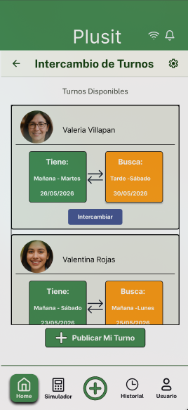
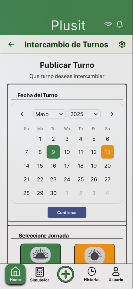

**The UX Challenge:** Coordinating schedule changes with peers verbally or on paper is chaotic, leading to scheduling gaps and miscommunications between workers and supervisors.

**Our Solution:**
* **Swapping Dashboard (Screen 1):** Lists available shift trades offered by coworkers as clear, actionable cards detailing the day, sector, and colleague's name.
* **One-Tap Posting (Screen 2):** Simple form to publish a shift for trade using large radio buttons, facilitating peer-to-peer schedule coordination in seconds.

---

### 5. Permits & Requests Flow

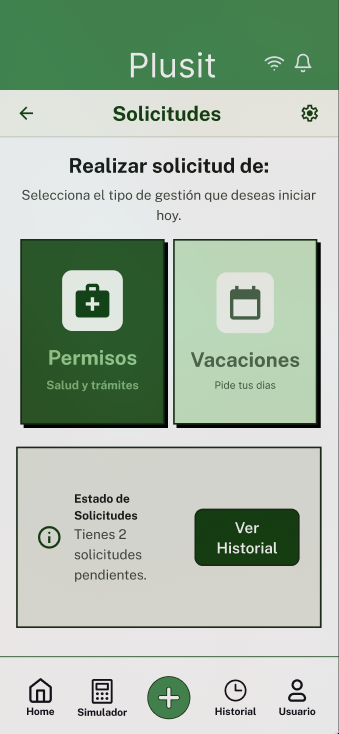
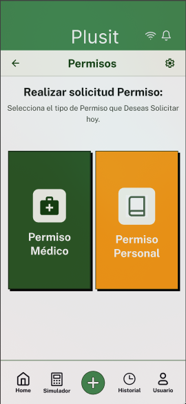
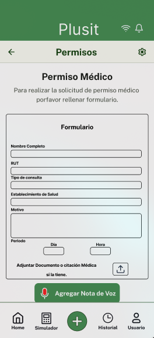
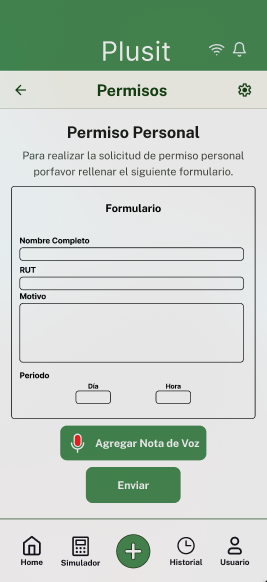
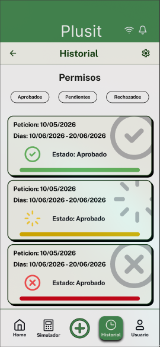
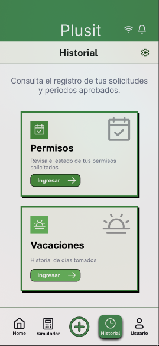

**The UX Challenge:** Having to write detailed text descriptions for administrative requests is a barrier for users with low digital literacy. Additionally, not knowing the approval status causes worker anxiety.

**Our Solution:**
* **Voice Note Requests (Screen 1, 2, 3 & 4):** Permits are requested by category. The user can hold a large microphone button to record a voice note explaining the emergency, completely avoiding textual entry.
* **Traffic Light Status Tracking (Screen 5 & 6):** Displays permit approvals in a clear list utilizing status lights (Green: Approved, Yellow: Pending, Red: Rejected) along with an audit log.

---

### 6. Vacations Flow

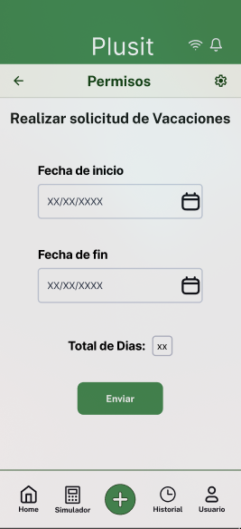
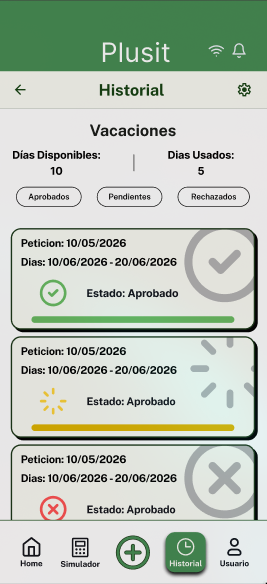

**The UX Challenge:** Standard calendar picking widgets are tiny and extremely difficult to click precisely, causing errors in vacation date selections.

**Our Solution:**
* **Oversized Calendar Selector (Screen 1):** A spacious calendar view designed with generous touch zones to easily select start and end dates.
* **Progressive Day Tracking (Screen 2):** Color-coded progress bars showing normal vs. progressive vacation days left, making PTO balances transparent.

---

### 7. Payments Flow

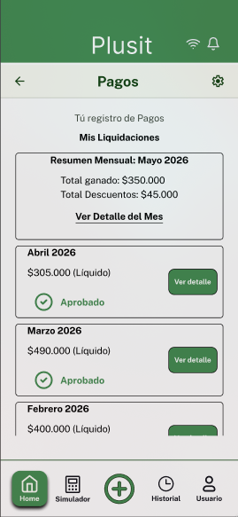
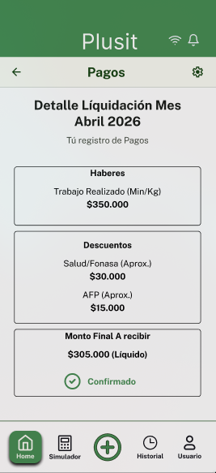

**The UX Challenge:** Corporate payroll PDFs are cluttered with legal jargon and tiny text, making it nearly impossible for workers to understand how their final pay is calculated.

**Our Solution:**
* **Simple Month Banners (Screen 1):** Clean list grouped by month, showing the final net payout in a large, bold font.
* **Visual Breakdown Chart (Screen 2):** Net pay is split into a simple bar chart representing base pay, yield bonuses, and deductions, making the payroll calculations understandable.

---

### 8. Benefits & Family Sharing Flow

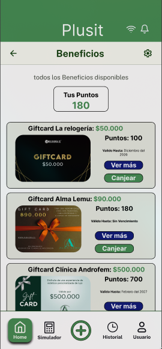
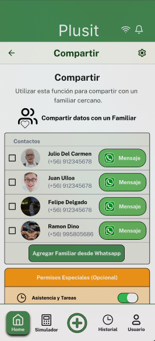

**The UX Challenge:** Accessing company rewards is difficult, and workers need a quick, distraction-free way to notify family members of their work status without typing.

**Our Solution:**
* **Incentive Catalog (Screen 1):** Simple grid cards representing rewards (food baskets, gear, vouchers) with clear point costs and a one-tap claim action.
* **WhatsApp Status Sharing (Screen 2):** A dedicated screen to share shift status or safety alerts. The worker can tap a button that automatically launches WhatsApp with a pre-written status message.

# 10. Final HD Screens (Advance II Refactor)
> **UX Element Plane: Surface** 

Based on peer feedback and usability testing, we executed a strategic pivot ("Less is more"), removing feature bloat (gamification, social sharing) to focus entirely on the MVP: an **Instant Salary Tracker** and **Offline Permits**. 

### 1. Authentication Flow (Frictionless Access)

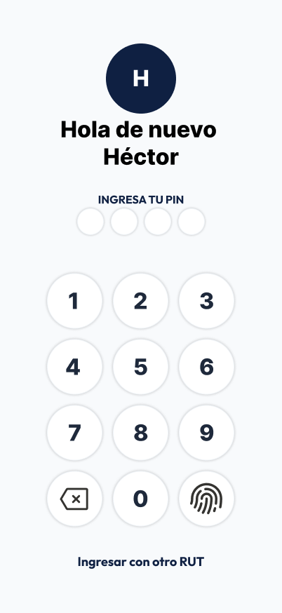

* **The Fix:** We removed the custom on-screen keyboard from the initial prototype that was causing heuristic consistency issues. 
* **The Solution:** The app now relies on native OS keyboards for standard input and features a streamlined PIN/Biometric pad for quick access, reducing cognitive load for returning workers.

### 2. Main Dashboard & Contract Profile

* **The Fix:** Previous menus were densely packed. 
* **The Solution:** A contextual Home screen that prioritizes proactive information: upcoming shifts, recent permit status, and instant salary visualization. The Profile acts as a digital contract, giving workers immediate access to their formal employer data and a direct call button for their supervisor.

### 3. The Core MVP: Instant Salary Tracker

* **The Fix:** Complex yield calculators and gamified points were removed.
* **The Solution:** A high-contrast, visually striking dashboard where seasonal workers can instantly see their accumulated monthly salary and a transparent breakdown of their daily approved earnings. This builds financial trust and eliminates payroll anxiety.

### 4. Offline Permits (Highly Optimized Forms)

* **The Fix:** Initial voice-note features proved technologically unfeasible for poor connectivity areas and caused UI friction.
* **The Solution:** A highly optimized, 4-step standard form utilizing native calendar selectors and large text areas. Usability testing proved this form allows critical medical absence requests to be completed in under 35 seconds.

### 5. Shift Swapping (Simplified)

* **The Fix:** Complex marketplace mechanics were scrapped.
* **The Solution:** A linear, direct peer-to-peer shift swapping tool. Workers can select a scheduled day and offer it to a specific colleague or the general pool with just three taps.

---

## 10. Advance II: Heuristic Evaluation Results
As mandated for the Advance II deliverables, our initial prototype underwent a rigorous peer-review Heuristic Evaluation. The critical breaches identified were:

* **Breach of Heuristic #8 (Aesthetic and minimalist design):** The initial UI suffered from chaotic composition, an overwhelming use of bright green tones, and a lack of typographic hierarchy, which drastically increased cognitive load.
* **Breach of Heuristic #4 (Consistency and standards):** Unnecessary duplication of the native OS numeric keyboard within the app interface.
* **Breach of Heuristic #2 (Match between system & real world):** Misleading button language (e.g., implying immediate family linking instead of sending external SMS invites).

**Resolution:** These findings were the primary driver for our complete UI refactor, resulting in the clean, accessible, off-white, and navy-blue design system seen in the final HD screens.

---

## 11. Advance II: Corrections & Feedback Implementation
To meet the rubric requirements of explicitly stating changes based on feedback (from professors, TAs, and peers), we implemented the following corrections:

1. **Strategic Pivot (Scope Reduction):** Instructed by the professor to "do less, but better", we completely removed the *Gamified Benefits System* and the *Social/Family Sharing Modules*.
2. **Color Palette Overhaul:** Replaced the "overwhelming green" with a professional high-contrast palette (Navy Blue text on Off-White backgrounds), reserving Emerald Green strictly for primary Call-to-Action buttons.
3. **Form Refinement:** Replaced the experimental voice-note feature with a highly optimized, oversized standard text/date form to ensure stability and speed.
4. **Component Standardization:** Enforced strict Auto-Layout rules in Figma to ensure consistent padding, card sizes, and alignment across all screens.

---

## 12. Advance II: Accessibility Themes
Based on the accessibility workshops discussed in class, Plusit incorporates specific design decisions tailored to the extreme physical environment of agricultural workers:

* **Fat-Finger Friendly Touch Targets:** Buttons, form fields, and navigation icons are oversized to accommodate workers operating with calloused hands or wearing work gloves.
* **High Contrast (WCAG Compliance):** The transition to dark typography on light backgrounds prevents glare issues when the app is used outdoors under direct sunlight.
* **Offline-First Resilience:** The architecture is designed to cache permit requests and shift data locally, ensuring the app remains usable in rural fields with zero cellular reception. 

---
*End of Advance II Documentation.*
